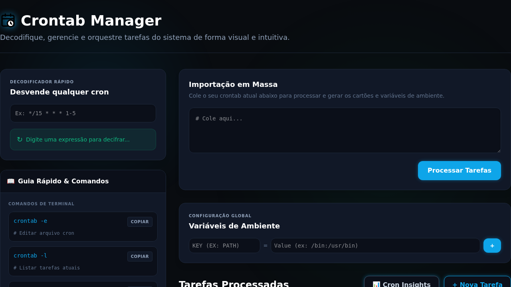

<p align="center">
  <!-- Você pode criar uma logo e colocar o link aqui -->
  
  <h1 align="center">⚡ Crontab Manager</h1>
</p>

<p align="center">
Decodifique, gerencie e orquestre tarefas do sistema de forma visual e intuitiva.
</p>

---

<p align="center">
  
  
  
  
</p>

🌐 **Live Demo:** [https://luizhanauer.github.io/crontab-manager/](https://luizhanauer.github.io/crontab-manager/)

---
<p align="center">
  
</p>

---

## 🎯 Por que utilizar o Crontab Manager?

Gerenciar a infraestrutura de um servidor através de arquivos de texto brutos é uma prática legada, propensa a falhas silenciosas, erros de sintaxe e gargalos de processamento. 

O **Crontab Manager** resolve esse problema transformando a rigidez do terminal num orquestrador visual, rodando 100% no seu navegador de forma segura (sem dependência de backend). Ele ajuda Engenheiros de Software e SysAdmins a **prevenir sobreposições perigosas** de scripts através de um Heatmap de execução de 24 horas (Cron Insights), **elimina a adivinhação de sintaxe** com traduções humanas em tempo real e **padroniza o redirecionamento de logs** para evitar discos cheios ou erros perdidos. É a ponte perfeita entre a robustez do Linux e a clareza visual moderna.

---

## ✨ Funcionalidades Principais

* **🔄 Importação & Exportação Transparente:** Cole o output do seu `crontab -l`, edite visualmente e copie/baixe o novo arquivo formatado e padronizado.
* **🧠 Decodificador Rápido em Tempo Real:** Digite qualquer expressão cron complexa e veja a tradução imediata para linguagem humana.
* **📊 Cron Insights (Auditoria de Tempo):** * *Heatmap de 24h:* Identifique facilmente gargalos de CPU onde muitas tarefas estão agendadas para o mesmo horário.
  * *Timeline de Disparos:* Veja a previsão exata das próximas execuções nas próximas 24 horas.
* **🛡️ Assistente de Logs Integrado:** Configure redirecionamentos seguros (`> /dev/null`, `>> arquivo.log`, `2> erro.log`) sem decorar operadores do bash.
* **⚙️ Gestão de Ambiente (ENVs):** Suporte nativo para gerenciar variáveis como `PATH` e `MAILTO` no topo do seu crontab.
* **🖱️ Organização Drag & Drop:** Reordene a prioridade visual das suas tarefas simplesmente arrastando os cartões.
* **⏸️ Pausa de Tarefas:** Comente/descomente tarefas do servidor com um único clique.
* **📦 Suporte a Macros:** Reconhecimento nativo de `@reboot`, `@daily`, `@hourly`, etc.

---

## 🏗️ Arquitetura & Engenharia

Este projeto não é apenas uma interface bonita; ele foi arquitetado sob rigorosos princípios de Engenharia de Software para garantir escalabilidade, testabilidade e manutenibilidade:

* **Domain-Driven Design (DDD):** Toda a lógica de parsing, cálculo de tempo e validação está isolada na camada de Domínio, agnóstica de framework (Vue).
* **Object Calisthenics (Zero `else`):** O código segue regras estritas de formatação funcional, utilizando retornos antecipados (*Early Returns*) e polimorfismo, banindo completamente a palavra reservada `else`.
* **Clean Architecture:** Componentes da UI (Vue) atuam apenas como camada de apresentação, delegando regras de negócio para *Value Objects* e *Entities* puros (`CronTask`, `CronPredictor`, etc).
* **TypeScript Estrito:** Compilação com `verbatimModuleSyntax` e tipagem forte em 100% do código.
* **Test-Driven Development (TDD):** Cobertura de testes unitários rápidos (< 50ms) nas regras de negócio via **Vitest**.

---

## 🚀 Instalação e Uso Local

Como a aplicação é construída com Vite, rodar localmente é extremamente rápido.

```bash
# Clone o repositório
git clone https://github.com/luizhanauer/crontab-manager.git

# Entre no diretório
cd crontab-manager

# Instale as dependências
npm install

# Inicie o servidor de desenvolvimento
npm run dev
```

### 🧪 Rodando os Testes de Domínio

Para garantir que as regras de negócio estão intactas:

```bash
npm run test
```

---

## 🛠️ Stack Tecnológica

* **Core:** Vue.js 3 (Composition API / `<script setup>`)
* **Linguagem:** TypeScript 5.9 (Strict Mode)
* **Estilização:** Tailwind CSS v4 (Tema Neon / Glassmorphism UI)
* **Build Tool:** Vite 7
* **Testes:** Vitest

---


Contribuição
------------

Contribuições são bem-vindas! Se você encontrar algum problema ou tiver sugestões para melhorar a aplicação, sinta-se à vontade para abrir uma issue ou enviar um pull request.

Se você gostou do meu trabalho e quer me agradecer, você pode me pagar um café :)

<a href="https://www.paypal.com/donate/?hosted_button_id=SFR785YEYHC4E" target="_blank"></a>


Licença
-------

Este projeto está licenciado sob a Licença MIT. Consulte o arquivo LICENSE para obter mais informações.


## 👨‍💻 Autor

Desenvolvido por **Luiz Hanauer**.
Focado em Arquitetura Limpa, Integridade de Domínio e Infraestrutura.
